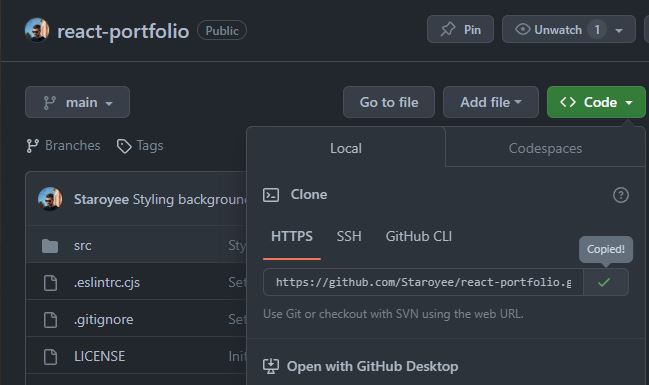
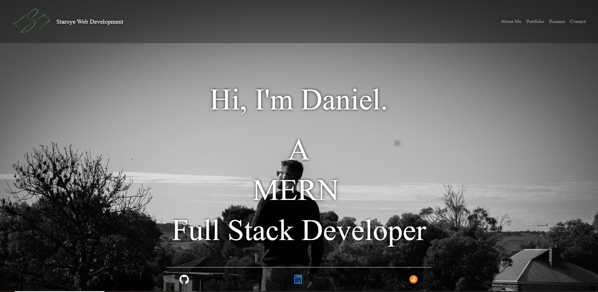

# Personal React Portfolio

## Description

Here you will find my fully responsive personal portfolio built using React.

## Key NPM Packages & Features

🔥 [Styled Components](https://styled-components.com/)\
🔥 [React Bootstrap](https://react-bootstrap.netlify.app/)\
🔥 [CSS in JS](https://cssinjs.org/?v=v10.10.0)\
🔥 [Framer Motion](https://www.framer.com/motion/)\
🔥 [Typewriter Effect](https://www.npmjs.com/package/typewriter-effect)\
🔥 [EmailJS](https://www.emailjs.com/)

## Portfolio Sections
```
🙋‍♂️ About me
```
```
💻 Portfolio
```
```
📜 Resume
```
```
📞 Contact
```

## Live Link

https://staroye.netlify.app/

## Installation
```
Steps to install this project on your local PC

1. Open the termal on your machine.
2. Use the terminal command `cd` to navigate to the directory where you want the repository located.
3. Locate the 'Code' button on the 'react-portfolio' github repository, click it, then copy the 'HTTPS' link to clipboard. (See image)
```

```
4. Use the git command `git clone` followed by the URL copied from Github to clone the repo to your machine.
5. The `git clone` command creates a new directory with the same name as the repository. Navigate into your new directory using `cd`.
6. The repository should now be cloned onto your device and able to be edited in VScode or another editing software.
```


## Instructions
```
If you wish to use this design as a template:

1. Follow installation instructions.
2. Change images and text fields to suit your needs.
3. Edit code as needed.
```
## Screenshot



## Resources
- https://styled-components.com/
- https://react-bootstrap.netlify.app/
- https://cssinjs.org/?v=v10.10.0
- https://www.framer.com/motion/
- https://www.npmjs.com/package/typewriter-effect
- https://github.com/ikatyang/emoji-cheat-sheet/blob/master/README.md
- https://www.emailjs.com/
